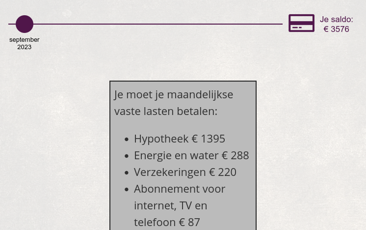
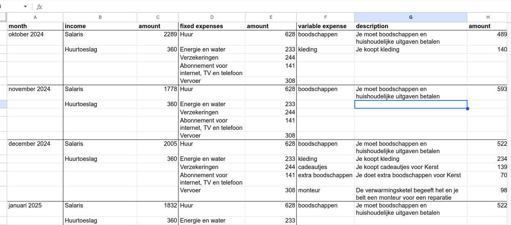
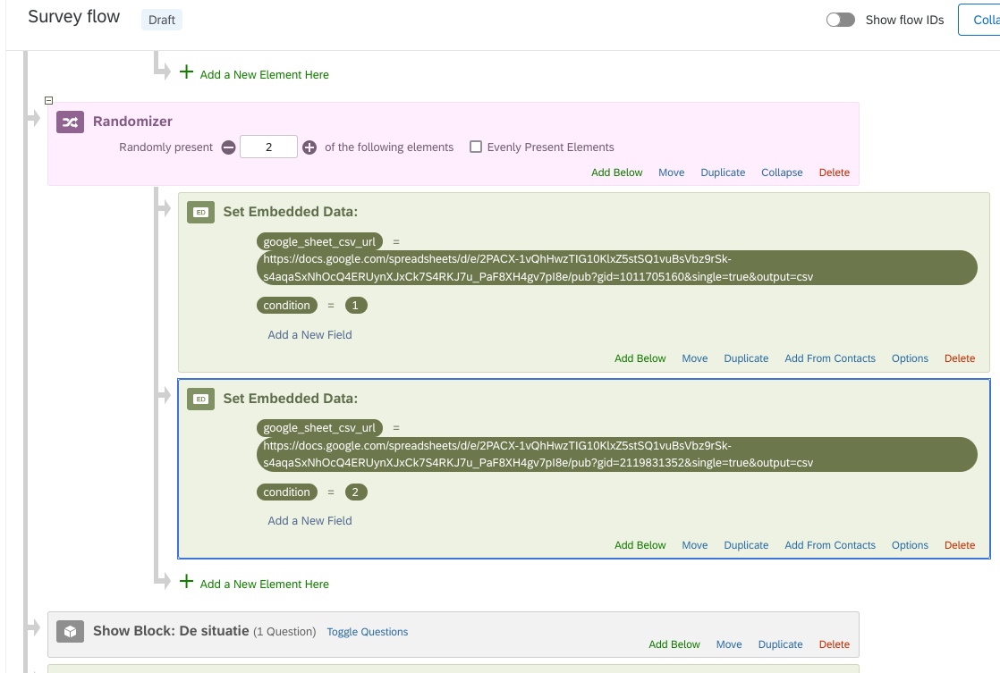
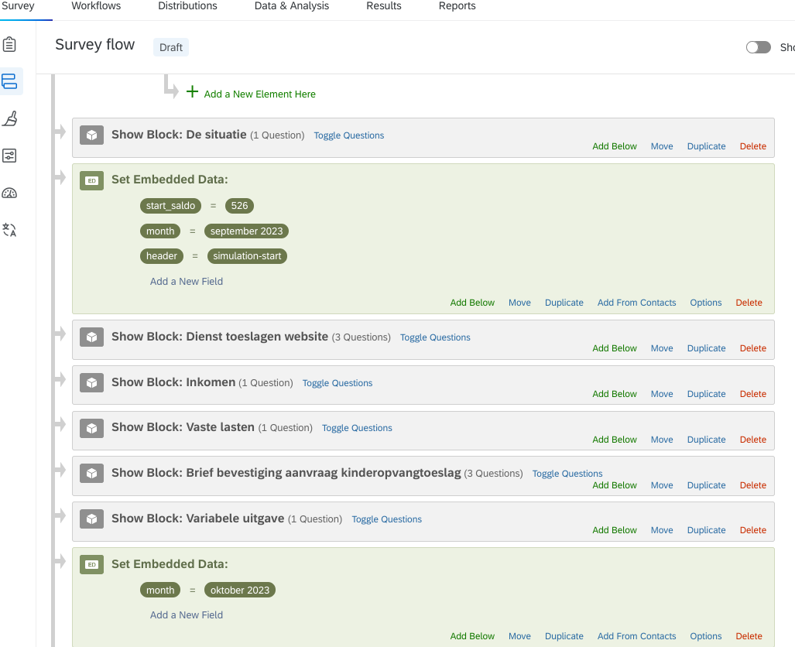

# Instructie Dienst Toeslagen Onderzoek

13 januari 2025 - Deze instructie betreft het gebruik door onderzoekers
van de geprogrammeerde uitbreidingen op Qualtrics door Chris de Jager

## Overview instructie

-   Zorg dat de toeslagen scripts zijn ingesteld in het project (dat
    doet Chris op verzoek)

-   Zorg voor een Excel bestand in het juiste format met alle bedragen
    voor alle maanden.

-   Configureer de start variabelen en start/stop de simulatie op de
    gewenste plek.

-   Voeg de dynamische blokken en je eigen vragen / blokken toe, en voeg
    de maand variabelen toe

-   Overige details



Als de simulatie wordt gestart ziet de participant bovenaan elk scherm
een tijdlijn met de maanden, en zijn huidige saldo rechts. De dynamische
blokken "Inkomsten", "Vaste lasten" en "Variabele uitgave" tonen
informatie uit een Excel bestand.

## Excel bestand met bedragen

We gebruiken een Excel bestand als overzichtelijke input voor de diverse
inkomsten en uitgaven van de simulatie. Dit wordt in Qualtrics
uitgelezen als een participant start met het onderzoek.

Als je de simulatie wil variëren tussen participanten, zoals
bijvoorbeeld een hoog en laag inkomen, maak je daarvoor meerdere
tabbladen (sheets) binnen hetzelfde Excel bestand. Je hoeft maar
**één bestand** publiek te delen; via de variabele **sheet_name** in
Qualtrics verwijs je naar het juiste tabblad per conditie.

**Essentieel om gelijk te houden per tabblad**:

-   De maandnamen (en het aantal maanden)

-   het aantal variabele uitgaven.

De beschrijvingen en bedragen van de variabele uitgaven mogen variëren.
Voor de inkomsten en vaste lasten ben je helemaal vrij om te variëren
(minimaal 1 naam en bedrag).

**Om het simpel te houden kun je een tabblad kopiëren en alleen de
bedragen wijzigen.**



De kolom positie bepaald hoe de informatie wordt geïnterpreteerd:

> A. **Maand naam: deze moet uniek zijn binnen de hele sheet!**  
> B. Inkomsten naam  
> C. Inkomsten bedrag  
> D. Vaste uitgaven naam  
> E. Vaste uitgaven bedrag  
> F. Variabele uitgave korte beschrijving  
> G. Variabele uitgave lange beschrijving  
> H. Variabele uitgave bedrag

Extra kolommen worden genegeerd. Alle inkomsten in een maand worden in 1
scherm getoond in Qualtrics. Dat geldt ook voor de vaste lasten. Van de
variabele lasten worden er echter steeds maar 1 regel per scherm
getoond. Vandaar dat het aantal variabele lasten per conditie/sheet
gelijk moeten zijn.

## Excel bestand delen via OneDrive

Het Excel bestand moet publiek gedeeld worden via OneDrive zodat het
vanuit de browser ingeladen kan worden.

> *(Screenshots worden nog toegevoegd)*

Zorg dat het bestand gedeeld is met de instelling "Anyone with the link
can view". De gedeelde link gebruik je vervolgens als waarde voor
**sheet_url** in Qualtrics (zie volgende paragraaf). Je hoeft dit maar
eenmalig in te stellen; alle sheets zijn daarna bereikbaar via
dezelfde URL.

## Configuratie start variabelen

De volgende variabelen dienen te worden gedefinieerd:

-   sheet_url

-   sheet_name

-   start_saldo

-   month

-   header

-   (optioneel) toeslag_naam en toeslag_percentage

## Sheet URL en sheet naam



Definieer deze aan het begin van je onderzoek (maar na de informed
consent keuze), bijvoorbeeld in de conditie branching.

De twee embedded variabelen die je instelt zijn:

-   **sheet_url**: de proxy-URL naar het gedeelde OneDrive Excel bestand:
    `https://cdn.chrisdejager.nl/proxy.php?url=<onedrive-deellink>`

-   **sheet_name**: de naam van het tabblad binnen het Excel bestand
    (exact gelijk aan de tabbladnaam, hoofdlettergevoelig). Gebruik je
    meerdere condities, dan stel je per conditie een andere sheet_name in
    via branching.

Omdat het laden van het bestand 1 à 2 seconden kan duren moet je de
variabelen instellen in een embedded data blok, en pas het tweede scherm
daarna kan de simulatie gestart worden.

**Dus:**

-   embedded data blok met sheet_url en sheet_name

-   **dan minimaal 1 tussenscherm/blok voor de participant**

-   dan een embedded data blok waarin de simulatie wordt gestart (zie
    onder)

-   dan zal de participant op het eerstvolgende scherm de tijdlijn en
    saldo zien

Als je geen tussenblok doet, dan zal de participant in het eerste scherm
een lege tijdlijn zonder saldo zien.

## Maand en start saldo

De maand die wordt getoond in de tijdlijn en waarvan de inkomsten /
lasten worden gebruikt in de dynamische blokken wordt bepaald door de
waarde van de "**month**" variabele. Zorg dat deze exact gelijk is aan
de naam van de maand in de sheets.

De variabele "**start_saldo**" bepaald het saldo waarmee een simulatie
start of verder gaat. Het is dus mogelijk om het saldo tussentijds te
"resetten" mocht je een sprong in de tijd willen maken.

## Start / stop simulatie

De header met de tijdlijn en saldo wordt "geactiveerd" door de variabele
"**header**" de waarde "simulation-start" te geven (zie screenshot).
Elke andere waarde laat de simulatie stoppen, maar gebruik voor de
duidelijkheid "simulation-stop".

Dit kun je ook gebruiken als je de simulatie wil pauzeren omdat je
vragen wil stellen aan de participant waarbij je de tijdbalk/saldo niet
wil laten zien.



## Toeslag naam en percentage (optioneel)

De variabele "toeslag_naam" bepaald welk bedrag uit uit het lijstje van
inkomsten van de maand wordt gezien als de toeslag. De variabele
"toeslag_percentage" bepaald welk percentage daarvan wordt gebruikt.

Als de participant een keuze heeft tijdens het onderzoek om dit
percentage te veranderen, dan zou je op basis van het antwoord de
toeslag_percentage kunnen instellen (via branching en embedded data).

Als toeslag_naam of toeslag_percentage niet zijn gedefinieerd dan wordt
hier niets mee gedaan.

Het percentage moet je als hele waarden instellen (dus 80 voor 80%).
Verder kun je overal mbv embedded data block de variabelen aanpassen.

## Dynamische blokken toevoegen

In de Builder van Qualtrics zijn drie blokken die dynamisch informatie
tonen en het saldo aanpassen:

-   Inkomen: toont lijstje met inkomsten binnen de huidige maand en
    verhoogt saldo

-   Vaste lasten: toont lijstje met vaste lasten van de huidige maand en
    verlaagt saldo

-   Variabele uitgave: toont de eerstvolgende variabele uitgave binnen
    de huidige maand en verlaagt saldo

De aanpassing van het saldo (omhoog/omlaag) vindt pas plaats nadat een
participant op volgende klikt.

Deze blokken kun je in de Survey Flow meerdere keren toevoegen d.m.v.
"Add Below" en dat het blok te kiezen. De werkwijze is dat je steeds de
maand (en evt het start saldo) instelt m.b.v. een embedded data blok en
daar je eigen blokken en de dynamische blokken toevoegt in de survey
flow. Let op dat je evenveel blokken 'variabele kosten' toevoegt in de
survey flow, als dat er kosten zijn gedefinieerd in het Excel bestand.
Zie het bovenstaande screenshot.

## Overig

## Debugging informatie

Als er iets anders gaat dan je verwacht, kun je "debugging"-informatie
bekijken die door het script naar de browser wordt gestuurd. Daarvoor
moet je de JavaScript debugging console openen.

Zo open je de console in de meest gebruikte browsers:

### Google Chrome

-   Windows/Linux: druk op Ctrl + Shift + J

-   macOS: druk op Cmd + Option + J

-   Of: klik rechts op de pagina → Inspecteren → tab Console

### Mozilla Firefox

-   Windows/Linux: Ctrl + Shift + K

-   macOS: Cmd + Option + K

-   Of: menu ☰ → Meer hulpmiddelen → Webontwikkelaarstools → Console

### Microsoft Edge

-   Windows/Linux: Ctrl + Shift + I

-   macOS: Cmd + Option + I

-   Of: klik rechts → Inspecteren → tab Console

### Safari (macOS)

-   Eerst inschakelen: Safari → Voorkeuren → Geavanceerd → vink Toon
    Ontwikkel-menu in menubalk aan.

-   Dan: Ontwikkel → Toon JavaScript-console of gebruik Cmd + Option +
    C.

## Tonen terugknop

De terug-knop kan getoond worden in een experiment, mits deze onder de
Qualtrics survey instellingen op enabled staat (zie onder).

De terug-knop zal nooit zichtbaar zijn bij de eerste sheet van een nieuw
block als er een ander soort block voor zat (bijvoorbeeld een embedded
data). Dit is een technische beperking van Qualtrics.

Daarnaast wordt de terug-knop niet getoond als de voorgaande "sheet"
zorgde voor een **saldo wijziging** (bijvoorbeeld in 1 van de dynamische
blokken). Dit wordt intern bijgehouden.

Het is mogelijk om de terug-knop selectief uit te schakelen door de
waarde 0 te geven aan de embedded data variabele
**enable_previous_button**. Om daarna de button weer te enablen moet je
de waarde 1 instellen.

**Qualtrics Survey instelling voor tonen van terug-knop**

Onder Survey options in Qualtrics, Responses: Enable Back button.

## Terugvordering simuleren

Soms willen we bij participanten een terugvordering simuleren. Omdat de
participanten soms de optie hebben om 80% van de toeslag te krijgen is
de hoogte van de terugvordering afhankelijk van die keuze. Dat betekent
dat we dat niet in het Excel bestand kunnen verwerken.

De oplossing is dat grotendeels met embedded data variabelen en
branching wordt opgelost.

-   Het bedrag van de terugvordering wordt ingesteld met behulp van
    branching.

-   Vervolgens wordt deze variabele gebruikt in het scherm waarin de
    participant wordt verteld dat de terugvordering gedaan gaat
    worden.

-   Vervolgens wordt op dat scherm een stukje javascript gebruikt zoals
    hieronder uitgelegd.

## "Handmatig" het saldo veranderen met bedrag XX

Dit kan gebruikt worden in situaties dat een conditionele verschillen
niet mbv het Excel bestand kunnen worden opgelost. Bijvoorbeeld als een
participant de keuze heeft voor 80% dan wel 100% toeslag - los van de
conditie waar hij/zij in zit.

Dit werkt met een simpel stukje javascript en functie naam
"applyCustomExpense". Je kan elk bedrag gebruiken. Als je een negatief
bedrag gebruikt zal het saldo omhoog gaan.

Stappen:

-   De onderstaande javascript code voeg je toe aan het block/"question"
    waar het saldo met XX gaat veranderen (na het klikken op
    volgende).

-   Je zet het bedrag binnen de functie, als je bijvoorbeeld het bedrag
    met 500 euro omlaag wil laten gaan, dan wordt het:
    `window.toeslagen.applyCustomExpense('500');`

-   Zoals in het voorbeeld kun je ook een variabele gebruiken. Dan is
    het mogelijk om

    -   mbv bijv branching het bedrag te bepalen

    -   en het bedrag in het scherm te tonen

```javascript
Qualtrics.SurveyEngine.addOnPageSubmit(function(type) {
  if (type === "next") {
    window.toeslagen.applyCustomExpense('${e://Field/toeslag_terugvordering}');
  }
});
```
